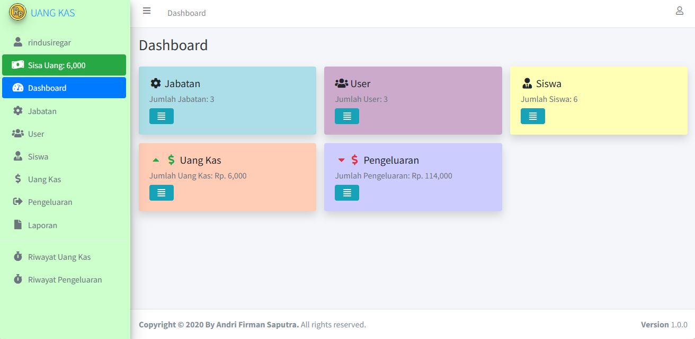
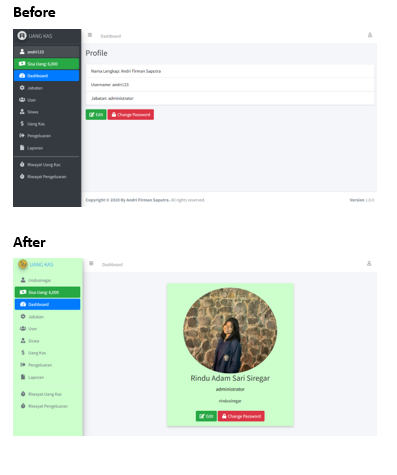
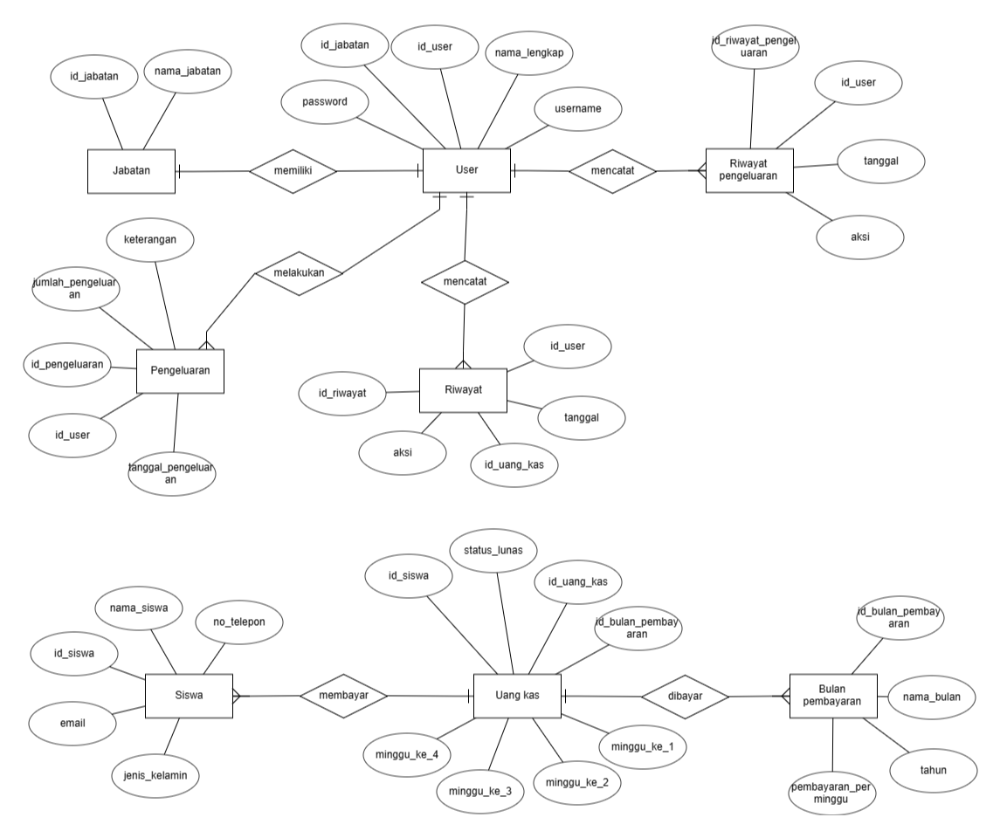

# sistem informasi pencatatan uang kas
Aplikasi Sederhana untuk mengelola uang kas sekaligus pengeluarannya. 
Aplikasi ini hanya dapat menghandle satu kelas saja.
Meskipun begitu, tapi aplikasi ini sangat praktis dan tetap optimal dengan bisa menghandle uang kas dalam beberapa tahun serta menyediakan fitur-fitur yang sangat dibutuhkan seperti: riwayat pembayaran dan pengeluaran, laporan hasil perbulan dan lain-lain. 

![Referensi] https://github.com/hako-975/aplikasi-uang-kas-dengan-php-native/blob/master/profile.php

![Login]

Administrator:

❥ Username: rindusiregar

❥ Password: 123456

![Perbedaan]

